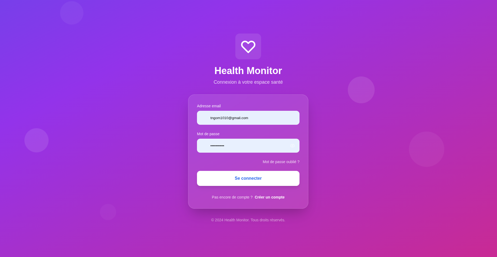
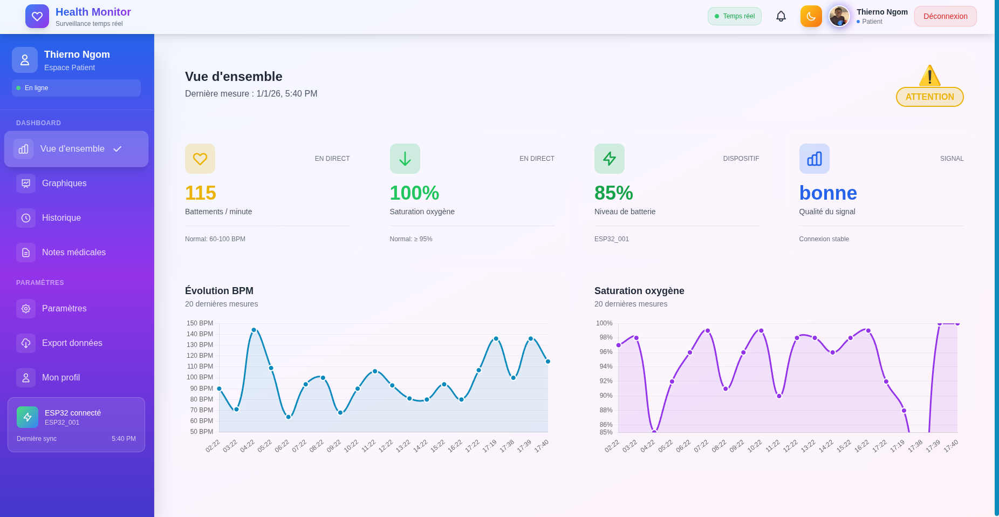
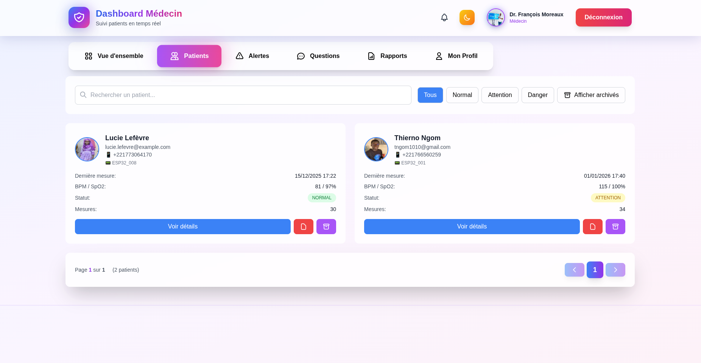
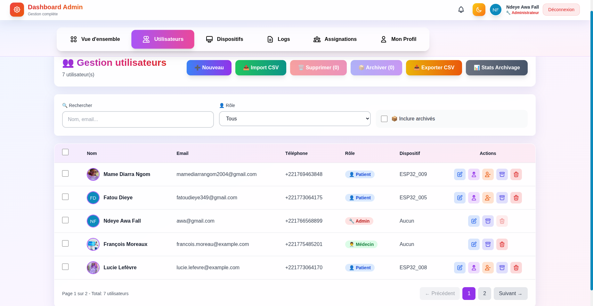
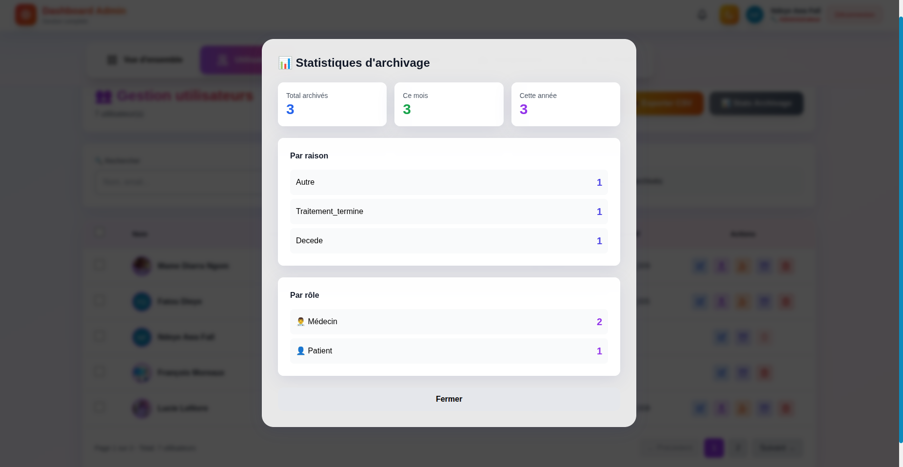

# 🏥 Health Monitor IoT

**Système de surveillance de santé en temps réel avec ESP32, Node.js et Angular**

[](https://github.com/thierno444/health-monitor)
[](LICENSE)
[](https://nodejs.org/)
[](https://angular.io/)
[](https://www.mongodb.com/)

---

## 🌟 Aperçu

Health Monitor est une plateforme IoT complète de surveillance de santé en temps réel connectant des dispositifs ESP32 équipés de capteurs MAX30102 à une application web moderne.

### 📸 Captures d'écran

<table>
  <tr>
    <td align="center">
      <br />
      <b>Page de connexion</b>
    </td>
    <td align="center">
      <br />
      <b>Dashboard Patient</b>
    </td>
  </tr>
  <tr>
    <td align="center">
      <br />
      <b>Dashboard Médecin</b>
    </td>
    <td align="center">
      <br />
      <b>Gestion Utilisateurs</b>
    </td>
  </tr>
  <tr>
    <td align="center" colspan="2">
      <br />
      <b>Système d'archivage RGPD</b>
    </td>
  </tr>
</table>

---

## ✨ Fonctionnalités principales

### 👤 Patient
- ✅ **Mesures temps réel** : BPM, SpO2, horodatage
- ✅ **Graphiques interactifs** : Chart.js avec zoom, export
- ✅ **Historique complet** : Filtrage par date
- ✅ **Alertes personnalisées** : Configuration seuils
- ✅ **Export données** : CSV, PDF

### 👨‍⚕️ Médecin
- ✅ **Dashboard multi-patients** : Vue globale
- ✅ **Alertes centralisées** : Priorité haute
- ✅ **Graphiques comparatifs** : Plusieurs patients
- ✅ **Notes médicales** : Commentaires privés
- ✅ **Rapports** : Export PDF par patient

### 🔧 Administrateur
- ✅ **Gestion utilisateurs** : CRUD complet
- ✅ **Archivage RGPD** : Export avant suppression
- ✅ **Dispositifs ESP32** : Assignation, sync
- ✅ **Logs audit** : 15+ types d'actions
- ✅ **Assignations** : Médecin-Patient avec priorités
- ✅ **Import CSV** : Création en masse
- ✅ **Statistiques** : Dashboard complet

---

## 🏗️ Architecture
```
┌─────────────┐
│   ESP32     │  Capteur MAX30102
│  + WiFi     │  → Mesure BPM/SpO2
└──────┬──────┘
       │ HTTP POST
       ▼
┌─────────────┐
│   Backend   │  Node.js + Express
│   MongoDB   │  + Socket.IO
└──────┬──────┘
       │ WebSocket
       ▼
┌─────────────┐
│  Frontend   │  Angular 17
│  Dashboard  │  + Chart.js
└─────────────┘
```

---

## 🚀 Technologies

| Couche | Technologies |
|--------|-------------|
| **Backend** | Node.js 18+, Express, MongoDB, Socket.IO, JWT |
| **Frontend** | Angular 17, TypeScript, Tailwind CSS, Chart.js |
| **Hardware** | ESP32, MAX30102, OLED 0.96" |

---

## 📦 Installation rapide

### Prérequis

- Node.js ≥ 18.0.0
- npm ≥ 9.0.0
- MongoDB ≥ 6.0
- Angular CLI : `npm install -g @angular/cli`

### Backend
```bash
cd health-monitor-backend
npm install
cp .env.example .env
# Configurer .env (MONGODB_URI, JWT_SECRET, etc.)
npm start
```

### Frontend
```bash
cd health-monitor-frontend
npm install
ng serve
```

Accéder : http://localhost:4200

### ESP32

1. **Câbler** selon schéma (voir [HARDWARE.md](docs/HARDWARE.md))
2. **Configurer** WiFi et API dans le code
3. **Téléverser** via Arduino IDE

---

## 📚 Documentation complète

- 📖 [**Guide installation**](docs/INSTALLATION.md) - Installation détaillée
- 🏗️ [**Architecture**](docs/ARCHITECTURE.md) - Diagrammes et flux
- 🔌 [**API Reference**](docs/API.md) - Endpoints et exemples
- 🔧 [**Hardware**](docs/HARDWARE.md) - Câblage ESP32
- 🚀 [**Déploiement**](docs/DEPLOYMENT.md) - Render + Vercel
- 🐛 [**Troubleshooting**](docs/TROUBLESHOOTING.md) - Résolution problèmes

---

## 🎯 Utilisation

### Patient
1. **Connexion** avec identifiants reçus par email
2. **Mesure** : Placer doigt sur capteur
3. **Consulter** dashboard temps réel
4. **Export** données CSV/PDF

### Médecin
1. **Vue globale** tous patients assignés
2. **Alertes** prioritaires en temps réel
3. **Notes** médicales privées
4. **Rapports** PDF personnalisés

### Admin
1. **Créer** utilisateurs (manuel ou CSV)
2. **Assigner** dispositifs ESP32
3. **Archiver** utilisateurs (RGPD)
4. **Consulter** logs audit

---

## 🔒 Sécurité

- ✅ **JWT** : Authentification tokens signés
- ✅ **bcrypt** : Hash mots de passe (10 rounds)
- ✅ **HTTPS** : Obligatoire en production
- ✅ **CORS** : Whitelist origines
- ✅ **Rate Limiting** : 100 req/15min/IP
- ✅ **RGPD** : Archivage 6 mois, droit à l'oubli

---

## 🚀 Déploiement

### Backend → Render.com
```bash
# Push sur GitHub
git push origin main

# Render détecte et déploie automatiquement
# URL : https://health-monitor-api-XXXX.onrender.com
```

### Frontend → Vercel
```bash
cd health-monitor-frontend
vercel --prod

# URL : https://health-monitor-frontend-XXXX.vercel.app
```

---

## 🤝 Contribution

Les contributions sont bienvenues !

1. **Fork** le projet
2. **Créer branche** : `git checkout -b feature/ma-feature`
3. **Commit** : `git commit -m "feat: Ma nouvelle fonctionnalité"`
4. **Push** : `git push origin feature/ma-feature`
5. **Pull Request**

Voir [CONTRIBUTING.md](CONTRIBUTING.md) pour les standards de code.

---

## 📝 Changelog

### v2.0.0 (2025-01-04)

#### ✨ Nouveautés
- Archivage & RGPD complet
- Assignations médecin-patient
- Import CSV utilisateurs
- Logs audit 15+ types
- Dashboard admin avancé

#### 🔧 Améliorations
- Performance pagination
- Validation temps réel
- Dark mode complet
- Responsive mobile

#### 🐛 Corrections
- Fix route archivage 404
- Fix modal désarchivage
- Fix export CSV
- Fix types logs

Voir [CHANGELOG.md](CHANGELOG.md) pour l'historique complet.

---

## 📄 License

**MIT License** - Voir [LICENSE](LICENSE)

---

## 👨‍💻 Auteur

**Thierno Ngom**

- 🌐 GitHub : [@thierno444](https://github.com/thierno444)
- 📧 Email : [tngom1010@gmail.com](mailto:tngom1010@gmail.com)
- 💼 LinkedIn : [linkedin.com/in/thierno-ngom](https://linkedin.com/in/thierno-ngom)

---

## 🙏 Remerciements

- **Angular**, **Node.js**, **MongoDB** teams
- **Espressif** pour ESP32
- **Maxim Integrated** pour MAX30102
- **Communauté open-source**

---

## ⭐ Support

Si ce projet vous aide :

- ⭐ **Star** sur GitHub
- 🐛 **Signaler bugs** via Issues
- 💡 **Proposer améliorations** via PRs
- 📢 **Partager** avec la communauté

---

<div align="center">

**Fait avec ❤️ par Thierno Ngom**

**Health Monitor IoT © 2025**

[Documentation](docs/) • [Demo](https://health-monitor-frontend.vercel.app) • [API](https://health-monitor-api.onrender.com/api)

</div>